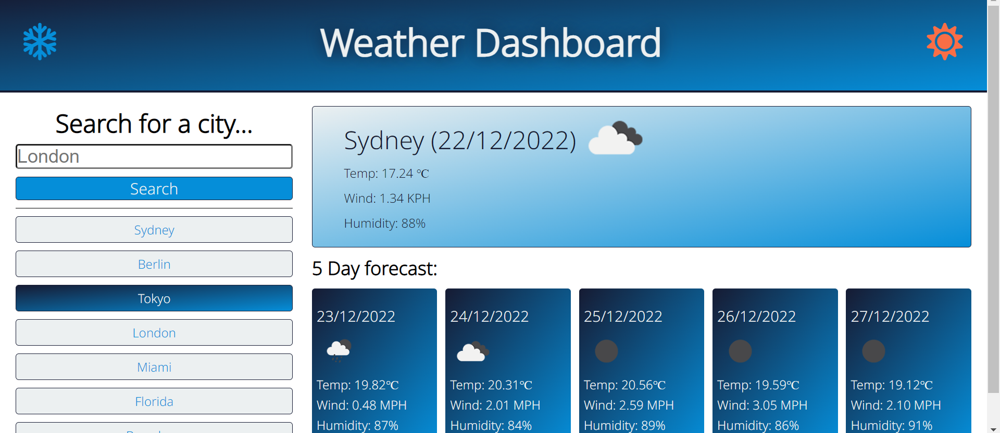

# Weather Dashboard

## Short description

The objective of this project is to create a weather dashboard that can be used to search for weather forecasts by the user. After searching via a city name the relevant information will be printed to the UI in order to allow the user to see the forecast. Also a limited previous search history will be stored in local storage and accessible at any time the user wants to use it. The information is retrieved via openweathermap API, this is what allows the dashboard to print dynamically relevant information.

The dashboard itself has media queries to allow it to work on a plethora of device sizes.

### User Story

```
AS A traveler
I WANT to see the weather outlook for multiple cities
SO THAT I can plan a trip accordingly
```

### Acceptance Criteria

The dashboard/app will load and function as intended. The ways in which it should work are as follows:

- The dashboard will look clear and easy to use

- It will work on multiple devices through the use of media queries

- When a user searches for a city they should be presented with:

  - A current forecast for the specified city.
  - A five day forecast that shows the weather for the next five days at 12PM
  - Each forecast should contain a date, weather icon, temperature, wind speed and humidity

- If a user searches for a city name that doesnt match a city name in the API database they will be displayed a error notification

- A search history section should be on display, each previous search can also be clicked to load its forecast again

- The search history will be sorted top to bottom in most recent search order

### Screenshot of completed site

The following image shows the web applications finished appearance



### License

Please refer to license in the Repo

# Website Link

https://britishcryptoguy.github.io/Weather-App/
